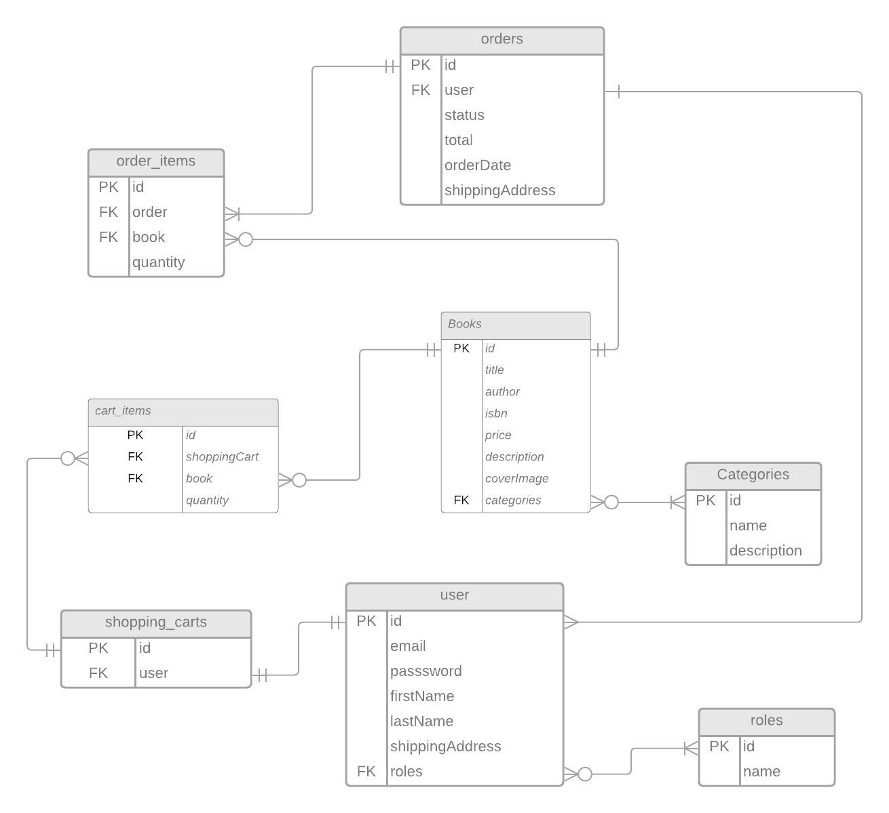

# "Online Bookstore"

---

### Project description:

'Online Bookstore' is a web application that simplifies book selection and purchase. Users can easily add, store, select, and buy books from various categories without visiting a physical store. The application utilizes Java-based server technologies like the Spring Framework, JWT, and Docker.

Online Book Store API offers comprehensive book and category management, order placement, and shopping cart features. It ensures a seamless experience for book enthusiasts and administrators, covering everything from book shopping to store management.

---

### Technologies
- Java 17
- Spring Boot, Spring Security, Spring data JPA
- REST, Mapstruct
- MySQL, Liquibase
- Maven, Docker
- Lombok, Swagger
- Junit, Mockito, testcontainers
---

### Current project functionality
The application has USER or ADMIN roles. The USER role is assigned automatically to each new user. Users can search for and select books either directly or by categories, then add them to their shopping cart and place orders. Meanwhile, administrators have the ability to update books and categories, delete them, and perform management tasks. Additionally, they are responsible for order statuses.

### Servers
http://localhost:8080/api - Generated server url

### Structure
My program follows a well-structured architecture pattern where the application logic is organized into distinct layers: controllers, services, and repositories. This architecture, commonly referred to as the "MVC" (Model-View-Controller) or "Service-Repository" pattern, promotes separation of concerns and maintainability. It allows for a clear distinction between the presentation layer (controllers), business logic (services), and data access layer (repositories), making the codebase more modular and easier to maintain.

### Databases
Here you can see the relationships between entities in my project.

### Authentication
The API uses JWT (JSON Web Tokens) for authentication. To access protected endpoints, include the generated JWT token in the `Authorization` header of your requests.

### Postman collection
You can use this collection of requests to test the application. 

https://www.postman.com/payload-architect-47195822/workspace/public/collection/29452702-88b36397-7d49-453b-aa33-d753888f5618?action=share&creator=29452702

### Endpoints
Authentication management - Endpoints for managing authentication
- POST: /auth/register Register
- POST: /auth/login Login

Order management - Endpoints for managing users orders
- GET: /orders Retrieve user's order history
- POST: /orders Place an order
- PUT: /orders/{id} Update shipping address
- PATCH: /orders/{id} Update order status
- GET: /orders/{orderId}/items Retrieve all OrderItems for a specific order
- GET: /orders/{orderId}/items/{itemId} Retrieve a specific OrderItem within an order

Category management - Endpoints for managing categories
- GET: /categories Find all categories
- POST: /categories Save a new category to DB
- GET: /categories/{id} Find category by id
- POST: /categories/{id} Update category data in DB
- DELETE: /categories/{id} Delete category by id
- GET /categories/{id}/books Get all books by category ID

Shopping cart management - Endpoints for shopping cart management
- PUT: /cart/cart-items/{cartItemId} Update quantity of a book in the shopping cart
- DELETE: /cart/cart-items/{cartItemId} Remove a book from the shopping cart
- GET: /cart Retrieve user's shopping cart
- POST: /cart Add book to the shopping cart

Book management - Endpoints for managing books
- GET: /books Find all books
- POST: /books Save a new book to DB
- GET: /books/{id} Find book by id
- POST: /books/{id} Update book data in DB
- DELETE: /books/{id} Delete book by id
- GET: /books/search Search book's by parameters
---
### Running the project:
1. Docker must be installed on your system.
2. You can configure database parameters in the [.env](.env) file.

### Personal difficulties
I encountered some challenges during the development process, particularly with Lazy initialization due to Lombok annotations and setting up relationships between entities in the project. Debugging and extensive online research (Googling) played a crucial role in overcoming these obstacles. The determination to create a robust API and resolve these issues helped me successfully complete the project.

## Conclusion
The Online Book Store API provides a comprehensive solution for establishing and maintaining an online bookstore. It offers an extensive array of features suitable for users and administrators alike, making it an ideal choice for any book-centric enterprise. Whether you're in the business of book sales or simply on the hunt for your next literary adventure, this API has you well-supported.
